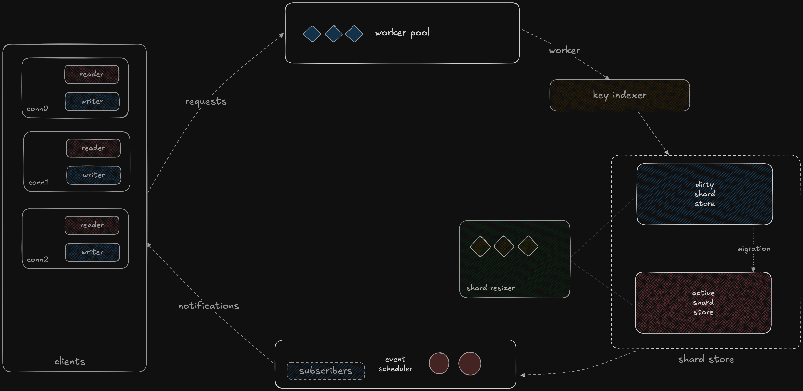

# NubMQ: A high performant key-value cache engine

- pure golang, no dependencies
- built from scratch
- highly available, wait free
- built in concurrency 
- outperforms legacy architectures

## 🏗 Architecture



### Adaptive Sharding: a self managing, self healing system

The system starts from a single bucket and scales up and down in real-time based on demand, when some keys expire, they immediately stop being served and are removed from the store in the next resizing

- **Exponential Shard Scaling:** Ensures that capacity grows logarithmically, preventing premature resource exhaustion.
- **Zero Downtime Resizing:** Live shard migration ensures that resizing doesn’t disrupt active requests, even when one store is overloaded, the other one takes it's place while the old store stabilises and still keeps serving reads
- **True Elasticity:** when the load contention per shard gets too big, the engine auto scales up the number of shards or buckets and when too many keys expire, it auto scales down
- **Two-Engine Model:** Writes shift to a larger engine when the contention becomes too big in one store while the old engine continues to serve reads during migrations.
- **Almost Lock-Free for Reads & Writes:** Eliminates contention, enabling high-frequency write workloads.
- **Just Run & Forget:** Once deployed, it self-manages and self-heales without intervention.

### Event-Based Notification Scheduler

NubMQ is **polling-free**—notifications are delivered **instantly**:

- **Event Scheduler:** No CPU-wasting polling, just instantaneous event-driven updates.
- **Supported Notifications:**
  - **Key Expiry:** Get notified the moment a key expires.
  - **Key Updates:** Get real-time updates when a key’s value gets updated.
- **Subscription Model:**
  - Clients can subscribe to any key channel for update notifications.
  - Subscribe to the `Ex` channel for listening to key expiries.
- **Highly Available, Non-Blocking Priority Message Delivery:**
  - If contention gets too high, the engine prioritizes **SET/GET operations** over event notifications.

### Event-Driven Connection Handling: No Bottlenecks, No Excuses

Each connection get's it's own read and write buffers to achieve non blocking IO across concurrent requests

- **Hierarchical Write Queues:** Critical operations (`SET`, `GET`) get priority over event notifications.
- **Ultra-fast Non-blocking I/O:** Every client interaction is a microsecond affair.

### Expiry & Subscription Notifications: Real time notifications without polling

NubMQ natively supports pub-sub model

- **Automatic TTL-based eviction**, ensuring memory efficiency without manual intervention.
- **Event subscription notifications,** so clients know instantly when keys change or expire.
- **No-polling required**, unlike slow, wasteful alternatives that hammer the system.
- **Garbage-Free Expiration Cleanup:** Expired key notification is sent instantly and they are soft deleted and are removed completely from the engine in the next upscale or downscale operation.

### Key Hashing:

Each key is hashed with a polynomial rolling hash and is indexed to a bucket in the shard store

- **Blazing-fast key lookup** with near-uniform distribution.
- **Zero collisions (almost),** thanks to an intelligent modulus strategy.
- **Deterministic performance**, meaning you won’t hit random performance cliffs.


### Dual-Store Model:

- **Two-tier Storage System:**
  - Each store contains multiple shards.
  - If a store becomes congested, **writes automatically move to a larger store**.
  - The old store keeps **serving reads** while silently migrating its data.
  - **Zero Downtime, No Waiting:** Clients never experience delays during store migration.
  - when the migration is done, the old store is removed from memory to be collected by Garbage collector

## 🛠 Features

- **Hyperfast SET / GET operations**
- **Built-in Expiry with TTL**
- **Real-time Subscription Mechanism**
- **Pure Golang, No Dependencies**
- **High-Performance Cache or NoSQL Mode** (Just increase memory limits)

### Command Support

```plaintext
SET <key> <value>
SET <key> <value> EX <expiry_time_in_seconds>
GET <key>
SUBSCRIBE <key>
```

## ⚡ Performance Beyond Limits

NubMQ squeezes out every drop of performance from modern CPUs:

- **Parallelized Goroutines:** No single-threaded nonsense—everything runs concurrently.
- **Lock-free reads, mutex-optimized writes:** You get the best of both worlds.
- **Atomic Operations:** Keeps data integrity rock-solid without unnecessary contention.
- **Benchmark Results:** 900µs write latency, 500µs read latency under extreme load.
- **Peak Throughput:** 115,809 ops/sec with 100 concurrent clients on an M2 MacBook Air.


## 📊 NubMQ vs. The Rest

| Feature                | NubMQ                 | Redis             | Memcached        | Etcd            |
|------------------------|----------------------|-------------------|-----------------|----------------|
| **Architecture**       | Adaptive Sharding   | Single-threaded  | Static Buckets  | Raft Consensus |
| **Scalability**        | Auto-Scales Up/Down | Vertical Scaling | Horizontal Only | Limited        |
| **Write Latency**      | **900µs**           | ~1.1ms           | ~1.5ms          | ~3ms           |
| **Read Latency**       | **500µs**           | ~700µs           | ~1ms            | ~2ms           |
| **Max Throughput**     | **115,809 ops/sec** | ~85,000 ops/sec  | ~60,000 ops/sec | ~20,000 ops/sec |
| **Pub/Sub Support**    | Yes, Instantaneous  | Yes, Slow        | No              | No             |
| **TTL Handling**       | Native, Optimized   | Yes, but Heavy   | No              | No             |
| **Lock-Free Reads**    | **Yes**             | No               | Yes             | No             |
| **Memory Efficiency**  | High, Dynamic GC    | Medium           | High            | Low            |
| **Dependencies**       | **None (Pure Go)**  | Libevent, Lua    | Libevent        | Raft           |

*figures from testing on M2 air or from official sources


## 📈 Benchmarks:


Benchmarked on a 8 core fanless M2 air
(all cores maxed out under load)

- Concurrent clients: 100
- Peak Throughput: 115809 ops/sec
- Average Throughput: 100961.54 ops/sec
- Dataset size: 1000000 unique Keys (to avoid key eviction)
- Total Operations: 21000000 requests
- Total Time Tracked: 208 seconds

## 🚀 WIP

Like everything else in life, this is still not perfect, these are some things which I plan to add to it

- **Parallelized Shard Store resizing:** each le
- **Clustering:** currently only supports single nodes