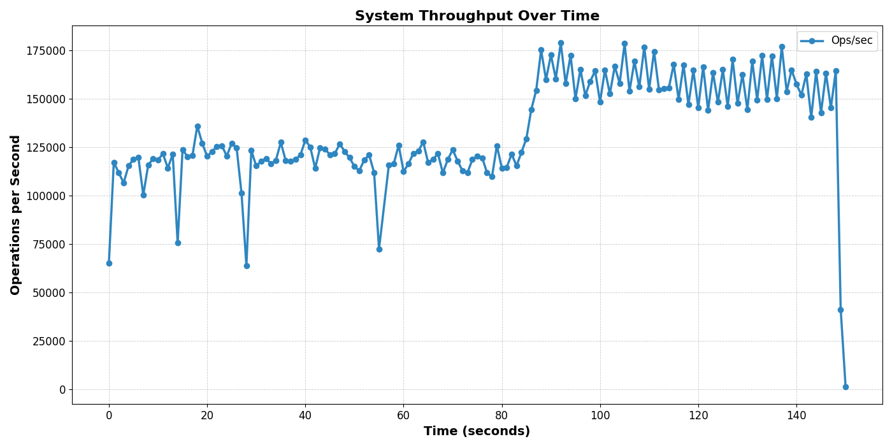

# 🚀 nubmq: a high performant key-value cache engine

A blazing-fast KV store written in pure Golang without any dependencies with native pub-sub support, engineered for high-frequency, contention-heavy workloads.


---

## 🧩 Adaptive Sharding: a self-managing, self-healing system

✨ The system starts from a single bucket and **scales dynamically** in real-time! When keys expire, they immediately stop being served and are removed during the next resizing.

- **Exponential Shard Scaling:** Ensures capacity grows logarithmically, preventing premature resource exhaustion.
- **Zero Downtime Resizing:** Live shard migration ensures uninterrupted operation. If one store is overloaded, the other takes its place seamlessly!
- **True Elasticity:** If load contention per shard increases, the engine scales up. If too many keys expire, it scales down.
- **Two-Engine Model:** Writes shift to a larger engine when contention grows too high while the old engine continues serving reads.
- **Wait free Reads & Writes:** Eliminates contention, enabling high-frequency write workloads.
- **Just Run & Forget:** Self-managing & self-healing—no babysitting required!

---

## 🔔 Event-Based Notification Scheduler

💡 **nubmq is polling-free**—notifications are delivered **instantly!** 📨, polling is for suckers

- **Event Scheduler:** No CPU-wasting polling, just pure event-driven updates!
- **Supported Notifications:**
  - **Key Expiry:** Get notified the moment a key expires.
  - **Key Updates:** Real-time updates whenever a key’s value changes.
- **Subscription Model:**
  - Clients can **subscribe** to any key channel for updates.
  - Listen to the `~Ex` channel for key expiries.
- **Highly Available, Non-Blocking Priority Message Delivery:**
  - When contention rises, **SET/GET operations** are prioritized over event notifications.

---

## Event-Driven Connection Handling: No Bottlenecks, No Excuses

💡 **Every connection gets its own read and write buffers** to enable non-blocking I/O across concurrent requests! 

- **Hierarchical Write Queues:** Critical operations (`SET`, `GET`) always get priority.
- **Ultra-fast Non-blocking I/O:** Every client interaction is measured in **microseconds**!

---

## Expiry & Subscription Notifications: Real-time Without Polling! 🚀

🛠️ **nubmq supports native pub-sub** 

- **Automatic TTL-based eviction** ensures memory efficiency without manual intervention.
- **Event subscription notifications** clients can subscribe for events/
- **No-polling required!** Uses SSE(server side events) for all notifications
- **Garbage-Free Expiration Cleanup:** Expired keys are soft deleted and permanently removed from engine during upscale/downscale operations.

## 🏗️ Dual-Store Model: Scaling Without Downtime

- 🏛️ **Two-tier storage system:**
  - Each store consists of multiple shards.
  - If a store gets congested, **writes shift to a larger store.** 
  - The old store **keeps serving reads** while data migrates.
  - **Zero downtime, no waiting!** Clients never experience delays.
  - Once migration is complete, the old store is removed from memory for **garbage collection**.

---

## 🛠 Features

- **Hyperfast SET/GET operations** 
- **Built-in Expiry with TTL** 
- **Real-time Subscription Mechanism** 
- **Pure Golang, No Dependencies** 
- **High-Performance Cache or NoSQL Mode** (Just increase memory limits)

---

## 📝 Command Support 

```plaintext
SET <key> <value>
SET <key> <value> EX <expiry_time_in_seconds>
GET <key>
SUBSCRIBE <key>
```

---

## Performance Beyond Limits 🏎️

nubmq squeezes every drop of performance from modern CPUs!

- **Parallelized Goroutines:** No single-threaded nonsense—everything runs concurrently.
- **Atomic Operations:** Ensures rock-solid data integrity.
- **Benchmark Results:** 900µs write latency, 500µs read latency under extreme load.
- **Peak Throughput:** 115,809 ops/sec with 100 concurrent clients on an M2 MacBook Air.

---

## 📊 nubmq vs. The Rest

| Feature                | nubmq                 | Redis             | Memcached        | Etcd            |
|------------------------|----------------------|-------------------|-----------------|----------------|
| **Architecture**       | Adaptive Sharding   | Single-threaded  | Static Buckets  | Raft Consensus |
| **Scalability**        | Auto-Scales Up/Down | Vertical Scaling | Horizontal Only | Limited        |
| **Write Latency**      | **900µs**           | ~1.1ms           | ~1.5ms          | ~3ms           |
| **Read Latency**       | **500µs**           | ~700µs           | ~1ms            | ~2ms           |
| **Max Throughput**     | **178,766 ops/sec** | ~85,000 ops/sec  | ~60,000 ops/sec | ~20,000 ops/sec |
| **Pub/Sub Support**    | Yes, Instantaneous  | Yes, Slow        | No              | No             |
| **TTL Handling**       | Native, Optimized   | Yes, but Heavy   | No              | No             |
| **Lock-Free Reads**    | **Yes**             | No               | Yes             | No             |
| **Memory Efficiency**  | High, Dynamic GC    | Medium           | High            | Low            |
| **Dependencies**       | **None (Pure Go)**  | Libevent, Lua    | Libevent        | Raft           |

📌 *Figures from testing on M2 Air or from official sources*

---

## 📈 Benchmarks

I recently replaced sync.map for buckets to a custom hashtable implementation and got a ~40 percent performance gain!



Benchmarked on a 8 core fanless M2 air (all cores maxed out under load)

- Concurrent Clients: **100**
- Peak Throughput: **178,766 ops/sec**
- Average Throughput: **133,333.33 ops/sec**
- Dataset Size: **1,000,000 unique keys**
- Total Operations: **20,000,000 requests**
- Total Time Tracked: **150 seconds**

Would love it if someone can test on a better machine and post the results

---

## How to run

first start the server with:

```bash
make build
```

run the benchmark with:

```bash
make test
```

or start the client with:

```bash
cd ./client
go run main.go
```

now just play around with commands like you do in redis-cli

---

## 🔨 WIP (Work in Progress)

- **Parallelized Shard Store resizing:** would make shard store resizing faster
- **Clustering:** currently only supports single nodes 🤖

---

nubmq is still a work in progress and is in no way perfect,there are still some data races here and there and a few unhandled errors feel free to report bugs and contributions in forms of issues and PRs are welcome
